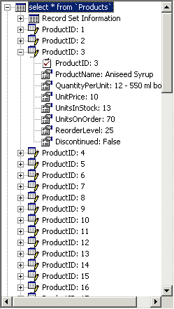



## \[DataTreeWrapper\] Class module, can wrap a whole database into TreeView Control

### Description

This sample program is just used to show you how to load the entire Database into a Tree View Control. (*This sample is complete DataEnvironment based.) The Recordset(the Command Object in the Data Environment Designer "Database") can be set by property pages in the designer. But here for the ease to use, I let you browse an Access MDB file. In fact, you can use any type of recordset(Excel, Access, DB, SQL, OBDC...).
 
### More Info
 

             |
---                |---
**Submitted On**   |
**By**             |[Kenny Lai, Lai Ho Wa](https://github.com/Planet-Source-Code/PSCIndex/blob/master/ByAuthor/kenny-lai-lai-ho-wa.md)
**Level**          |Advanced
**User Rating**    |4.7 (174 globes from 37 users)
**Compatibility**  |VB 6\.0
**Category**       |[Databases/ Data Access/ DAO/ ADO](https://github.com/Planet-Source-Code/PSCIndex/blob/master/ByCategory/databases-data-access-dao-ado__1-6.md)
**World**          |[Visual Basic](https://github.com/Planet-Source-Code/PSCIndex/blob/master/ByWorld/visual-basic.md)
**Archive File**   |

### Source Code

[DataTreeWrapper] Class module, can wrap a whole database into TreeView
Control

This sample program is just used to show you how to load the entire Database into a Tree View Control. (*This sample is complete DataEnvironment based.) The Recordset(the Command Object in the Data Environment Designer "Database") can be set by property pages in the designer. But here for the ease to use, I let you browse an Access MDB file. In fact, you can use any type of recordset(Excel, Access, DB, SQL,
OBDC...).

Download Here:

<a href="http://pcseries.sourceforge.net/pscode/DataTreeWrapper.zip">http://pcseries.sourceforge.net/pscode/DataTreeWrapper.zip</a>

See it and please give comments, and vote. Thanks

Kenny;)

